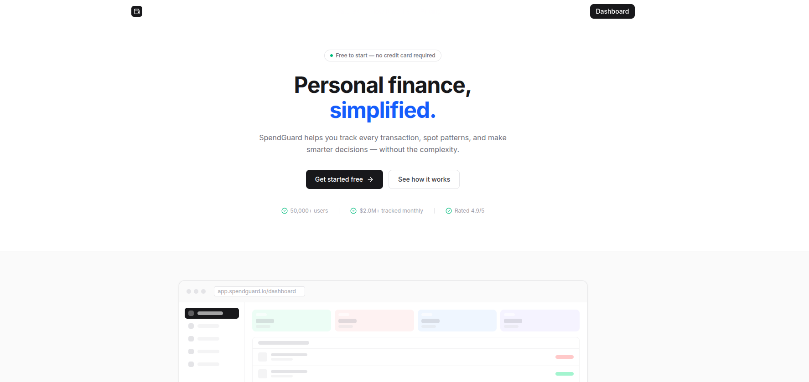

<p align="center">
  
</p>

# 🌌 SpendGuard — Personal Finance Management System

<p align="center">
  
</p>

[](https://frontend.spendguard.app)
[](https://api.spendguard.app)
[](https://postgresql.org)
[](https://typescriptlang.org)

SpendGuard is a clean, minimal personal finance management application. It features a compact, professional SaaS interface alongside robust financial tracking, automated reports, and intelligent data analysis.

---

## 🚀 Project Overview

SpendGuard is built as a modular full-stack application, providing a seamless bridge between a secure Node.js RESTful API and a modern Next.js frontend.

### ✨ Key Features
- **📊 Interactive Analytics**: Visualize your spending trends with high-fidelity charts and category-wise breakdowns.
- **🛡️ Secure Authentication**: JWT-based security with persistent sessions and protected dashboard routing.
- **📈 Subscription Intelligence**: Automatically detect and track recurring subscriptions with pattern recognition.
- **📩 Automated Reporting**: Receive weekly and monthly financial summaries directly in your inbox.
- **📥 CSV Bulk Import**: Batch process 1000+ transactions with intelligent auto-categorization.
- **📱 Responsive Design**: Fully optimized experience across mobile, tablet, and desktop with a clean, content-focused UI.

---

## 🏗️ Architecture

The project is organized into two primary micro-modules:

| Component | Responsibility | Technology |
| :--- | :--- | :--- |
| [**🖥️ Frontend**](./frontend/README.md) | User Interface & Experience | Next.js 14, Tailwind CSS |
| [**⚙️ Backend**](./backend/README.md) | Business Logic & API Layer | Node.js, Express, PostgreSQL |

---

## 🛠️ Tech Stack

### Frontend
- **Framework**: Next.js 14 (App Router)
- **Styling**: Tailwind CSS 4.x
- **Icons**: Lucide React
- **State Management**: Zustand (Persistent Auth Store)
- **Charts**: Recharts

### Backend
- **Server**: Express.js with TypeScript
- **Database**: PostgreSQL 17
- **Auth**: JSON Web Tokens (JWT) & Bcrypt
- **Automation**: Node-Cron for scheduled reports
- **Email**: Nodemailer with SMTP integration

---

## ⚡ Quick Start

### Prerequisites
- Node.js 18+
- PostgreSQL 17 (Running on port 5433 by default)

### Setup Instructions

1. **Clone the repository**
   ```bash
   git clone https://github.com/your-username/spendguard.git
   cd spendguard
   ```

2. **Setup Backend**
   Follow the [Backend Setup Guide](./backend/README.md) to initialize the database and start the server.

3. **Setup Frontend**
   Follow the [Frontend Setup Guide](./frontend/README.md) to install dependencies and start the dashboard.

---

## 📖 Documentation

For detailed information on specific modules, refer to our comprehensive documentation:
- 🗺️ **[Full Setup Guide](./docs/SETUP.md)**
- 📡 **[API Documentation](./docs/api/README.md)**
- 🗄️ **[Database Schema](./database/schema.sql)**
- 🚀 **[Deployment Guide](./docs/DEPLOYMENT.md)**
- 📧 **[Email Configuration](./docs/EMAIL_SETUP.md)**

---

## 📜 Development History
This project was developed over 8 weeks. Detailed summaries of each phase can be found in the [docs/](./docs/) directory:
- [Week 8: Final Dashboard & Polishing](./docs/WEEK8_SUMMARY.md)
- [Deployment Readiness](./docs/DEPLOYMENT.md)

---

## ⚖️ License
Distributed under the MIT License. See `LICENSE` for more information.

---

<p align="center">
  Developed with ❤️ by <b>Ridoy Baidya</b>
</p>