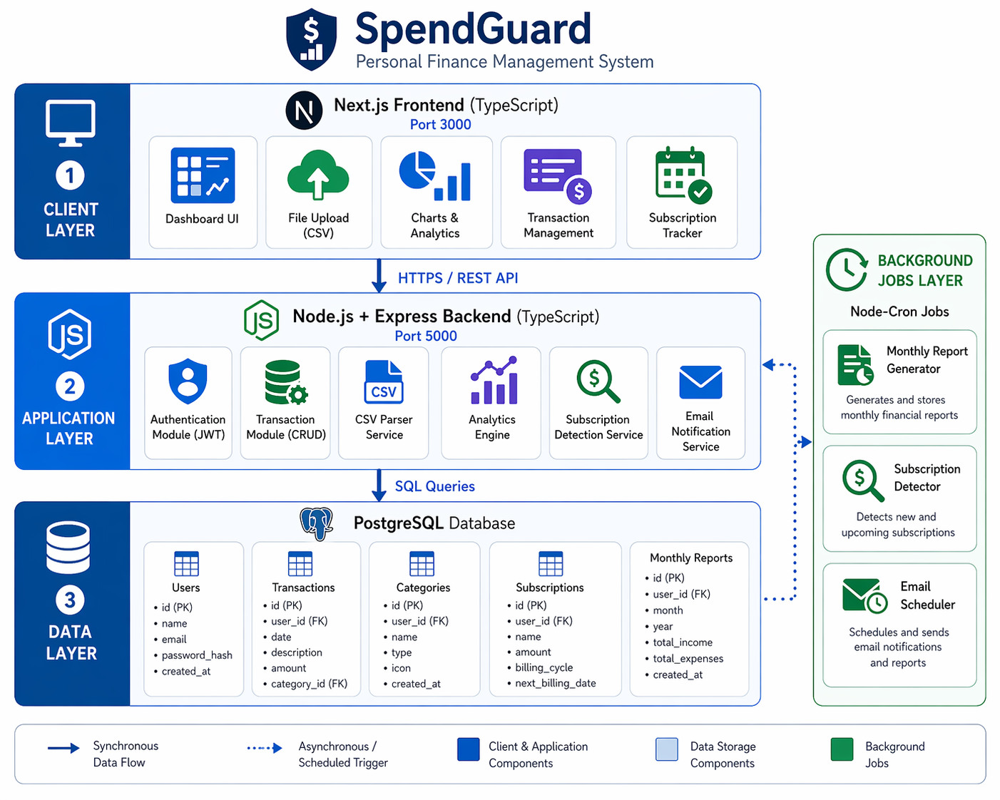
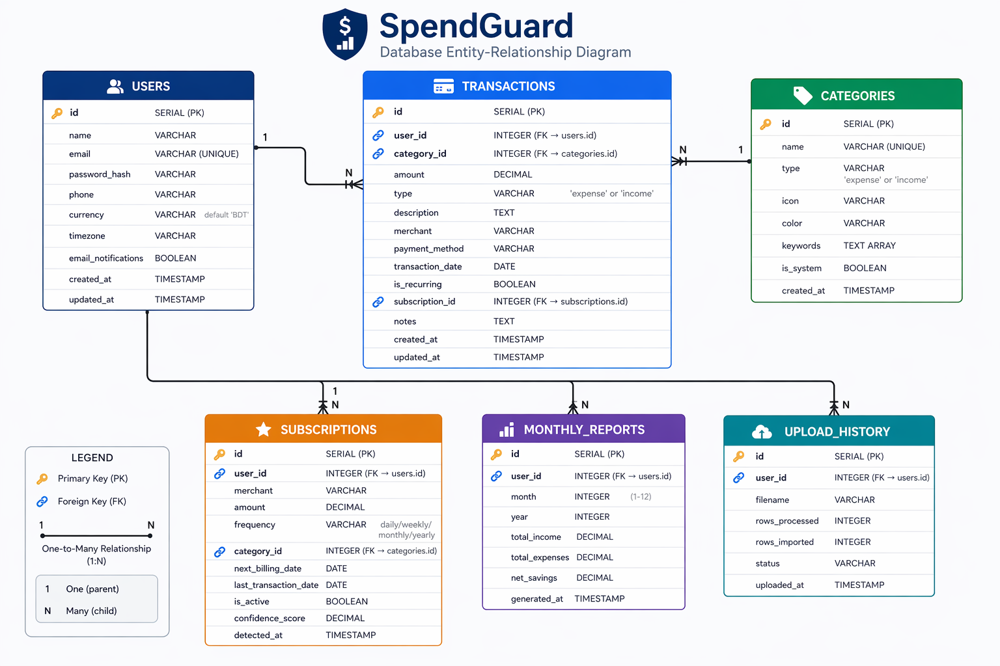
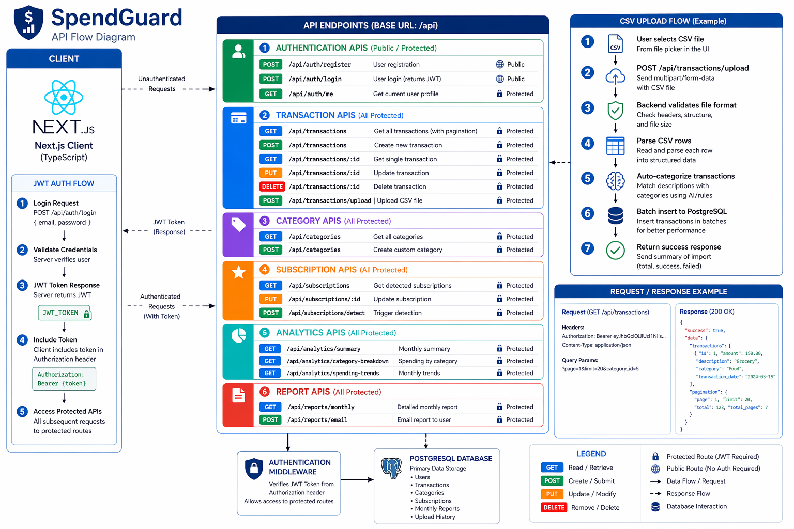

<div align="center">



# 🛡️ SpendGuard
### Personal Finance Management System

[](https://nodejs.org)
[](https://typescriptlang.org)
[](https://nextjs.org)
[](https://postgresql.org)
[](LICENSE)

**Track income, expenses, subscriptions, and gain smart financial insights — all in one place.**

[🚀 Get Started](#-getting-started) · [📐 Architecture](#-system-architecture) · [🗄️ Database](#️-database-design) · [🔌 API](#-api-reference) · [✅ Progress](#-week-1-progress)

</div>

---

## 📖 Overview

SpendGuard is a full-stack personal finance management system built with **Next.js + TypeScript** on the frontend and **Node.js + Express + PostgreSQL** on the backend. It helps you:

- 📊 **Track** every income and expense with categories
- 📤 **Import** bank statements via CSV upload
- 🔄 **Detect** recurring subscriptions automatically
- 📈 **Visualise** spending trends with rich analytics charts
- 📧 **Receive** monthly financial reports via email
- 🔐 **Secure** all data with JWT authentication

---

## 📐 System Architecture

The system follows a classic **3-layer architecture**:

| Layer | Technology | Port |
|---|---|---|
| Client (Frontend) | Next.js 15 + TypeScript + Recharts | 3000 |
| Application (Backend) | Node.js + Express + TypeScript | 5000 |
| Data (Database) | PostgreSQL 15 | 5432 |

Background jobs (Node-Cron) handle: Monthly Report Generation, Subscription Detection, Email Scheduling.

<details>
<summary>📸 View System Design Diagram</summary>


</details>

---

## 🗄️ Database Design

SpendGuard uses **6 inter-related PostgreSQL tables**:

```
USERS ──────────────── TRANSACTIONS ─── CATEGORIES
  │                         │
  ├── SUBSCRIPTIONS          ├── MONTHLY_REPORTS
  └── UPLOAD_HISTORY
```

| Table | Purpose |
|---|---|
| `users` | Auth, profile, currency/timezone preferences |
| `transactions` | Income & expense records with categories |
| `categories` | System + custom labels with icon/color/keywords |
| `subscriptions` | Auto-detected recurring payments |
| `monthly_reports` | Pre-computed monthly financial summaries |
| `upload_history` | CSV import audit log |

<details>
<summary>📸 View Database ER Diagram</summary>



</details>

---

## 🔌 API Reference

All endpoints are prefixed with `/api`. Protected routes require:
```
Authorization: Bearer <JWT_TOKEN>
```

<details>
<summary>📸 View Full API Flow Diagram</summary>



</details>

### 🔐 Authentication
| Method | Endpoint | Access | Description |
|---|---|---|---|
| `POST` | `/api/auth/register` | Public | Register new user |
| `POST` | `/api/auth/login` | Public | Login (returns JWT) |
| `GET` | `/api/auth/me` | Protected | Get current user |

### 💳 Transactions
| Method | Endpoint | Description |
|---|---|---|
| `GET` | `/api/transactions` | List (paginated, filterable) |
| `POST` | `/api/transactions` | Create transaction |
| `GET` | `/api/transactions/:id` | Get single |
| `PUT` | `/api/transactions/:id` | Update |
| `DELETE` | `/api/transactions/:id` | Delete |
| `POST` | `/api/transactions/upload` | CSV Import |

### 🏷️ Categories
| Method | Endpoint | Description |
|---|---|---|
| `GET` | `/api/categories` | List all categories |
| `POST` | `/api/categories` | Create custom category |
| `PUT` | `/api/categories/:id` | Update category |
| `DELETE` | `/api/categories/:id` | Delete (non-system only) |

### ⭐ Subscriptions
| Method | Endpoint | Description |
|---|---|---|
| `GET` | `/api/subscriptions` | List active subscriptions |
| `PUT` | `/api/subscriptions/:id` | Update subscription |
| `POST` | `/api/subscriptions/detect` | Trigger auto-detection |

### 📊 Analytics
| Method | Endpoint | Description |
|---|---|---|
| `GET` | `/api/analytics/summary` | Monthly income/expense totals |
| `GET` | `/api/analytics/category-breakdown` | Spend per category |
| `GET` | `/api/analytics/spending-trends` | Multi-month trend data |

### 📄 Reports
| Method | Endpoint | Description |
|---|---|---|
| `GET` | `/api/reports/monthly` | Full monthly report |
| `POST` | `/api/reports/email` | Email report to user |

### CSV Upload Flow
```
User selects CSV → POST /api/transactions/upload
  → Validate format → Parse rows → Auto-categorize
  → Batch insert → Return { total, imported, failed }
```

---

## 🚀 Getting Started

### Prerequisites
- **Node.js** v18+
- **PostgreSQL** v15+
- **npm** v9+

### 1. Clone the Repository
```bash
git clone https://github.com/ridoy-pc/spendex.git
cd spendex
```

### 2. Backend Setup
```bash
cd backend
npm install
cp .env.example .env
# Edit .env with your DB credentials and JWT secret
```

### 3. Database Setup
```bash
# Create the database
psql -U postgres -c "CREATE DATABASE spendguard;"

# Run schema (creates all tables + seeds categories)
psql -U postgres -d spendguard -f src/database/schema.sql
```

### 4. Start the Backend
```bash
npm run dev
# Server running on http://localhost:5000
# Health check: http://localhost:5000/health
```

### 5. Frontend Setup
```bash
cd ../frontend
npm install
# .env.local already configured to point to localhost:5000
```

### 6. Start the Frontend
```bash
npm run dev
# App running on http://localhost:3000
```

---

## 📁 Project Structure

```
spendex/
├── backend/
│   ├── server.ts                  # Entry point
│   └── src/
│       ├── app.ts                 # Express app config
│       ├── config/
│       │   └── database.ts        # PostgreSQL pool
│       ├── middleware/
│       │   └── auth.ts            # JWT middleware
│       ├── routes/
│       │   ├── auth.ts
│       │   ├── transactions.ts
│       │   ├── categories.ts
│       │   ├── subscriptions.ts
│       │   ├── analytics.ts
│       │   └── reports.ts
│       └── database/
│           └── schema.sql         # Full DB schema + seeds
├── frontend/
│   └── src/
│       ├── app/
│       │   ├── dashboard/page.tsx
│       │   ├── transactions/page.tsx
│       │   ├── categories/page.tsx
│       │   ├── subscriptions/page.tsx
│       │   ├── analytics/page.tsx
│       │   ├── reports/page.tsx
│       │   ├── login/page.tsx
│       │   └── register/page.tsx
│       ├── components/
│       │   ├── Sidebar.tsx
│       │   └── AppShell.tsx
│       ├── context/
│       │   └── AuthContext.tsx
│       └── lib/
│           ├── api.ts             # Axios instance
│           └── utils.ts           # Helpers
└── docs/
    └── diagrams/
        ├── System_Design.png
        ├── Database_Design.png
        └── API_Design.png
```

---

## ⚙️ Environment Variables

### Backend (`backend/.env`)
```env
PORT=5000
NODE_ENV=development

DB_HOST=localhost
DB_PORT=5432
DB_NAME=spendguard
DB_USER=postgres
DB_PASSWORD=your_password

JWT_SECRET=your_jwt_secret_key
JWT_EXPIRE=7d

EMAIL_HOST=smtp.gmail.com
EMAIL_PORT=587
EMAIL_USER=your_email@gmail.com
EMAIL_PASSWORD=your_app_password

FRONTEND_URL=http://localhost:3000
```

### Frontend (`frontend/.env.local`)
```env
NEXT_PUBLIC_API_URL=http://localhost:5000/api
```

---

## 🛠️ Tech Stack

### Frontend
| Tech | Purpose |
|---|---|
| Next.js 15 (App Router) | React framework + routing |
| TypeScript | Type safety |
| Recharts | Analytics charts (area, bar, pie, line) |
| Axios | HTTP client with JWT interceptors |
| Lucide React | Icon library |

### Backend
| Tech | Purpose |
|---|---|
| Node.js + Express | HTTP server & REST API |
| TypeScript | Type safety |
| PostgreSQL + `pg` | Primary database |
| JWT (`jsonwebtoken`) | Authentication tokens |
| bcryptjs | Password hashing |
| Multer | CSV file upload handling |
| csv-parser | Parse CSV rows |
| Nodemailer | Email notifications |
| Node-Cron | Background jobs |
| Helmet + CORS | Security middleware |

---

## ✅ Week 1 Progress

| Task | Status |
|---|---|
| GitHub repository setup | ✅ Done |
| Project structure created | ✅ Done |
| PostgreSQL installed & configured | ✅ Done |
| All database tables created (6 tables) | ✅ Done |
| Categories seeded (12 system categories) | ✅ Done |
| Express server running with health checks | ✅ Done |
| Full backend routes (auth, transactions, categories, subscriptions, analytics, reports) | ✅ Done |
| JWT authentication middleware | ✅ Done |
| CSV upload with auto-categorisation | ✅ Done |
| Next.js frontend scaffold | ✅ Done |
| Dark-theme design system (globals.css) | ✅ Done |
| Auth pages (Login + Register) | ✅ Done |
| Dashboard (stats + charts + recent transactions) | ✅ Done |
| Transactions CRUD + CSV import modal | ✅ Done |
| Categories management + emoji/color picker | ✅ Done |
| Subscriptions auto-detect page | ✅ Done |
| Analytics page (line + bar + pie charts) | ✅ Done |
| Monthly reports + email | ✅ Done |
| System Design, DB ER & API Flow diagrams | ✅ Done |
| README.md completed | ✅ Done |

---

## 📅 Upcoming (Week 2)

- [ ] Nodemailer email integration (monthly reports scheduler)
- [ ] Node-Cron background jobs
- [ ] Budget limits & alerts
- [ ] Unit & integration tests
- [ ] Docker Compose setup
- [ ] Vercel + Railway deployment

---

## 👤 Author

**Ridoy Baidya**  
Personal Finance Management System — SpendGuard

---

## 📝 License

This project is licensed under the **MIT License** — see the [LICENSE](LICENSE) file for details.